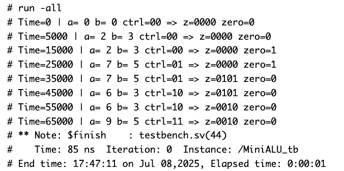
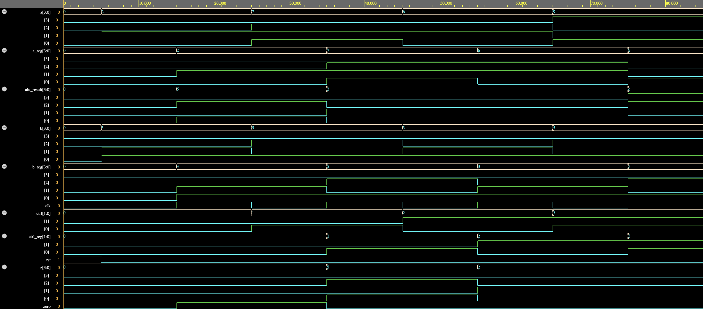

## REPORT

This mini project implements a 3-stage pipelined Arithmetic Logic Unit (ALU) in Verilog. The design separates the operation into three pipeline stages: **Operand Registering**, **Execution**, and **Result Storage**. It performs simple operations including `ADD`, `SUB`, `AND`, and `XOR` on 4-bit inputs, controlled via a 2-bit control signal.

---

## ALU Design

- **Supported Operations**:
  - `00`: AND
  - `01`: OR
  - `10`: ADD
  - `11`: XOR

- **Pipeline Stages**:
  - **Stage 1**: Input operand registers latch values of `a` and `b`.
  - **Stage 2**: ALU performs logic/arithmetic operations.
  - **Stage 3**: Result is registered and driven to the output `z[3:0]`.

- **Inputs**:
  - `a[3:0]`, `b[3:0]` — Operands
  - `ctrl[1:0]` — Operation select
  - `clk`, `rst` — Clock and reset

- **Outputs**:
  - `z[3:0]` — ALU result
  - `zero` — High if result is zero

---

## Simulation Details

The project was simulated using **Icarus Verilog** for compilation and **Siemens Questa 2024.3** on **EDA Playground** for waveform generation. The testbench applies a sequence of operations and input combinations across clock cycles to validate the pipelined behavior.

---

### Terminal Output

Below is a screenshot of the printed simulation results showing ALU outputs per clock cycle:

---

### Waveform Output

The waveform confirms correct pipelined behavior: inputs are latched, processed, and results emerge with expected delays. You can observe a consistent 3-cycle latency between input and output.

---

## Summary

This project demonstrates:

- A working 3-stage ALU pipeline in Verilog
- Use of control logic and case statements for instruction decoding
- Register-based pipelining to stage execution and outputs
- Simulation flow using Icarus Verilog and Questa
- Basic waveform and timing verification using EPWave

