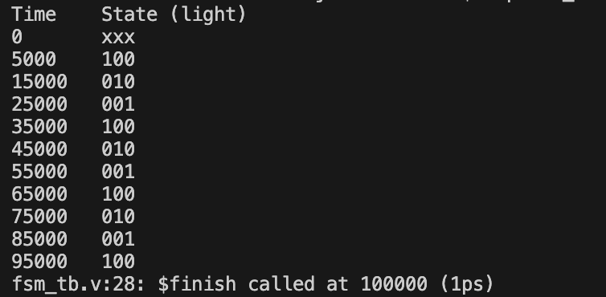
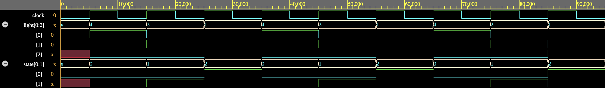

## Moore FSM: Traffic Light Controller

This mini project implements a simple **Moore finite state machine (FSM)** in Verilog to simulate a basic traffic light controller. The design transitions through three states (RED, GREEN, YELLOW) purely based on a clock signal, with no external inputs aside from the clock.

## FSM Design

- **States:**  
  - `S0` → RED (`3'b100`)  
  - `S1` → GREEN (`3'b010`)  
  - `S2` → YELLOW (`3'b001`)

- **Transition Order:**  
  `S0 → S1 → S2 → S0 → ...`  
  Transitions occur on each positive clock edge.

- **Output:**  
  The output `light[2:0]` is driven solely by the current state (Moore model behavior).

## Simulation Details

The design was simulated using **Siemens Questa 2024.3** on **EDA Playground**. The testbench generates a clock signal and runs through several clock cycles to validate the FSM’s behavior.

### Terminal Output

Below is a snapshot of the printed simulation results showing the timing and output state (`light`):

### Waveform Output

The waveform visually confirms the correct state transitions and the corresponding light values:

## Summary

This project demonstrates:
- Moore FSM implementation in Verilog
- Use of `case` statements for state transitions and output logic
- Basic waveform analysis and simulation with **Questa Advanced Simulator**
